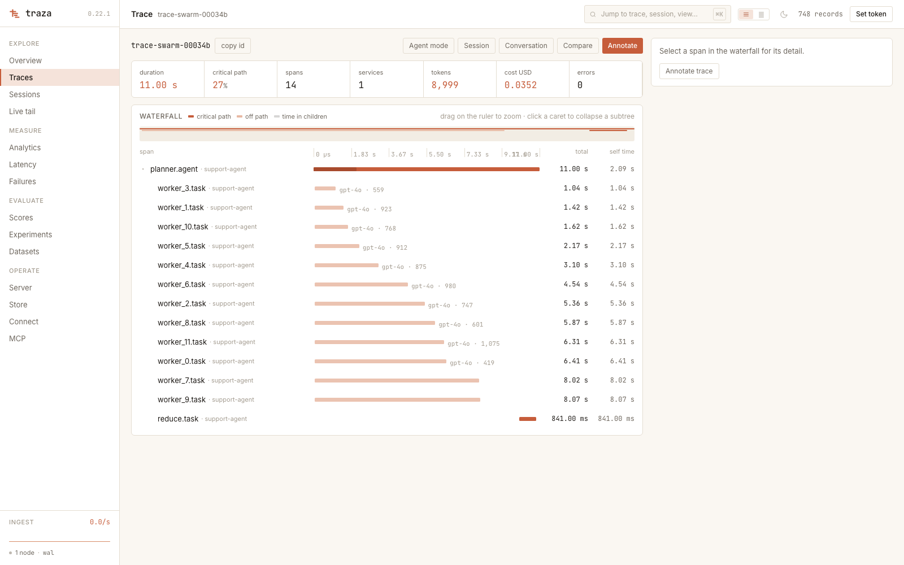

Traza
=====

Traza is a trace database for LLM and agent workloads. It runs as a single binary with no external database, no queue, and no coordinator.

**Sub-millisecond trace lookup. 3.3 ms filtered search over a million spans. 208,000 spans/s sustained ingest.** One process, one directory.

[](https://github.com/toshish/traza/actions/workflows/ci.yml)
[](https://crates.io/crates/traza)
[](LICENSE)


*Replayed from real runs of the [demo tour](examples/README.md) — six scripted proofs, one
command each. Every number a demo prints is measured on your machine while you watch, each
script asserts its own claims, and CI runs all six. Clone, then pick one:*

```sh
./examples/swarm/run.sh      # a live agent cockpit in the dashboard, until Ctrl-C
./examples/crash/run.sh      # kill -9 mid-ingest; every acknowledged span survives
./examples/needle/run.sh     # a million spans in, one sentence found in milliseconds
./examples/incident/run.sh   # an agent diagnoses a runaway over MCP, promotes, diffs
./examples/vanish/run.sh     # tenant-precise erasure, and a receipt that names the backup
```

## Install

### Download

The server with the dashboard already built in. No Rust, no Node.

```sh
VERSION=0.22.1
PLATFORM=macos-aarch64          # or linux-x86_64, linux-aarch64

curl -LO https://github.com/toshish/traza/releases/download/v$VERSION/traza-$VERSION-$PLATFORM.tar.gz
tar xzf traza-$VERSION-$PLATFORM.tar.gz
cd traza-$VERSION-$PLATFORM
```

### Docker

```sh
docker run -p 8080:8080 -v traza-data:/data \
  -e TRAZA_TOKENS="rw:$(openssl rand -hex 16)" \
  ghcr.io/toshish/traza:latest
```

### Cargo

```sh
cargo install traza --locked --bin traza-server
```

Installs the server and API. The dashboard ships with the release archives, or build it from [`ui/`](ui/).

To embed the engine directly in your own process instead:

```sh
cargo add traza
```

### From source

```sh
git clone https://github.com/toshish/traza && cd traza
cargo build --release
(cd ui && npm ci && npm run build)
```

## Run

```sh
./traza-server
```

```
traza-server listening on 127.0.0.1:8080
traza-server: durability=wal — acknowledged writes are fsynced to the write-ahead log and recovered on restart
traza-server serving dashboard from ./ui/dist
```

That is the whole setup. Data lands in `./data`, the dashboard is on <http://localhost:8080>.

### Common options

| Flag | Default | |
|---|---|---|
| `--data-dir DIR` | `./data` | All state. One writer process per directory. |
| `--host ADDR` | `127.0.0.1` | A non-loopback bind requires `TRAZA_TOKENS`. |
| `--port PORT` | `8080` | `0` binds an ephemeral port and announces it. |
| `--durability MODE` | `wal` | `buffered`, `wal`, or `flushed`. Every response says which one answered. |
| `--profile NAME` | `balanced` | `throughput`, `balanced`, or `latency`. Sets the write-path knobs together. |
| `--ttl-seconds N` | off | Retention window for spans, annotations and payloads. |
| `--mcp` | off | Serve Model Context Protocol at `/v1/mcp`. |
| `--ui-dir DIR` | beside the binary | Where the built dashboard lives. |
| `--restore DIR` | | Install a backup into `--data-dir`, then serve it. |
| `TRAZA_TOKENS` | unset | Bearer auth: `rw:` and `ro:` scoped, plus `admin:` for erasure. Bind a credential to one tenant with `rw@acme:token`. |

`--help` prints all thirty-one. The [configuration reference](docs/configuration.md) explains what each one costs.

### Examples

**Serving a team.** Named paths, an open bind address with auth, thirty days of retention, and the agent endpoint on:

```sh
export TRAZA_TOKENS="rw:$(openssl rand -hex 16),ro:$(openssl rand -hex 16)"

./traza-server \
  --data-dir /var/lib/traza \
  --host 0.0.0.0 \
  --ttl-seconds 2592000 \
  --mcp
```

**Bulk backfill.** The `throughput` profile seals larger segments and lets more acknowledgements share one fsync, which is what you want when nothing is waiting on any single batch:

```sh
./traza-server --data-dir /var/lib/traza --profile throughput
```

**A client blocking on the acknowledgement.** The `latency` profile trades peak ingest for a materially better p95:

```sh
./traza-server --data-dir /var/lib/traza --profile latency
```

**Tests and CI.** `buffered` is the fastest mode and lossy by design, which is exactly right for a store you are about to throw away. Port `0` picks a free port and prints it, so parallel test runs do not collide:

```sh
./traza-server --data-dir "$(mktemp -d)" --port 0 --durability buffered
```

**Debugging an agent from your terminal.** Serve MCP, then point a client at it:

```sh
./traza-server --mcp
claude mcp add --transport http traza http://localhost:8080/v1/mcp
```

**Backing up a running server.** Pin and verify a consistent copy, take it, then release the pin:

```sh
curl -X POST http://localhost:8080/v1/backups/nightly
cp -a ./data/pins/nightly /backups/traza-$(date +%F)
curl -X POST http://localhost:8080/v1/backups/nightly/release
```

**Restoring one.** Verified before anything is swapped, then served:

```sh
./traza-server --data-dir /var/lib/traza --restore /backups/traza-2026-08-10
```

**Erasing a session, and proving it.** Deletion by trace, span, session, tenant or payload, published at a checkpoint; the receipt re-checks every domain by name:

```sh
curl -X POST http://localhost:8080/v1/erasures \
  -H 'Content-Type: application/json' \
  -d '{"subject": {"kind": "session", "session_id": "sess-42"}}'

curl http://localhost:8080/v1/erasures/1/verify
```

## Send a span

```sh
curl -X POST http://localhost:8080/v1/spans \
  -H 'Content-Type: application/json' \
  -d '[{
    "trace_id": "trace-1",
    "span_id": "span-1",
    "name": "charge",
    "service": "checkout",
    "start_time_unix_nano": 1700000000000000000,
    "end_time_unix_nano": 1700000000002500000,
    "status": "ok"
  }]'
```

```json
{"accepted":1,"durability":"wal"}
```

Or point an existing app at it with two environment variables:

```sh
export OTEL_EXPORTER_OTLP_ENDPOINT=http://localhost:8080
export OTEL_EXPORTER_OTLP_PROTOCOL=http/protobuf
```

Apps instrumented with OpenLLMetry or the OpenTelemetry GenAI conventions arrive with sessions and token/cost analytics already populated. No attribute renaming, no mapping file.

## What you get



**Fast reads.** Trace lookup at p95 0.64 ms and filtered search at p95 3.3 ms over a million spans. Full-text search across prompt text returns a selective term in 1.5 ms where scanning takes 1,258 ms.

**One process.** No metadata database, no column store, no lock service, no object store to configure. It starts in milliseconds, and there is no control plane to lose a quorum at 3am.

**A small surface.** Two direct dependencies, twelve packages in the whole lockfile, a 2.2 MB binary. HTTP, threading and file I/O are the standard library, and the crate is `#![forbid(unsafe_code)]`.

**Agent telemetry as the workload.** Sessions, token and cost rollups, prompts and completions with large ones offloaded and deduplicated, evals and human feedback attached after the fact, live tail, and one-command dataset export.

**An endpoint your agent can query.** `--mcp` serves Model Context Protocol from the same binary and port: ten tools shaped like the questions people actually ask, with stored span text confined as untrusted and results bounded in tokens.

**Durability you choose.** Three acknowledgement modes, and every response states which one answered it. The suite proves them by killing the process, not by asserting.

**Backup without stopping.** One call pins and verifies a consistent copy of spans, annotations and payload bytes together. Restore is one flag.

**Deletion with a receipt.** Erase a trace, a session, a whole tenant, or one offloaded payload from every domain — buffer, log, segments, annotations, payload files, datasets — then prove it: `verify --erasure` re-checks each domain by name and reports the result of each, down to the pinned backup that still holds the bytes and the dataset example that carries a promoted copy.

**Tenants in the key, not bolted on.** Span identity is `(tenant, trace_id, span_id)`, so two customers sharing a trace id can never overwrite each other. A token bound with `rw@acme:token` writes and reads exactly one tenant on every surface; retention takes per-tenant windows; `GET /v1/tenants` accounts usage per tenant. Single-tenant stores write byte-identical files and notice nothing.

**The eval loop is representable.** Promote failing production traces into an immutable, content-addressed dataset version — examples keep their own copies, so deleting the source trace cannot corrupt them — run the experiment with your own harness, record runs and scores against `(experiment, example, span)`, and read score distributions and experiment-over-experiment diffs back out. Identity and addressing only: no runner, no scorer library, and your workflow stays yours.

## Performance

| | |
|---|---|
| Trace lookup, 1M spans | p95 **0.64 ms** |
| Filtered search, 1M spans | p95 **3.3 ms** |
| Content search, selective term | **1.5 ms** (1,258 ms scanning) |
| Sustained ingest, `wal` | **208,973 spans/s** |
| Binary | **2.2 MB** |
| Direct dependencies | **2** |

Every number is produced by a benchmark bundled in this repo, run over the real HTTP path. The harness writes the records itself and refuses to publish a result it cannot stand behind. Run them yourself with `cargo run --release --bin bench`.

## When not to use Traza

**Disk cost is your binding constraint.** Segments are uncompressed JSON plus indexes and cost 1.8–2.1× the bytes you send. A columnar engine writing compressed files to object storage will beat that by an order of magnitude. The exception is agent context: a repeated system prompt above the offload threshold is stored once, measured at 121:1 in Traza's favour.

**You need metrics and logs in the same system.** Traza stores traces and their analytics. That is the whole surface, on purpose.

**You need horizontal scale-out today.** Traza is single-node.

## Documentation

Everything is in **[docs/](docs/README.md)** — getting started, the HTTP API, LLM semantics, the MCP server, deployment, durability, backup and restore, capacity, and the engine internals.

## Contributing

See [CONTRIBUTING.md](CONTRIBUTING.md). Stable Rust is the only dependency, `./ci.sh` is the merge bar, and a new dependency needs a written reason.

## License

Copyright © 2026 Toshish Jawale. [Apache-2.0](LICENSE).
